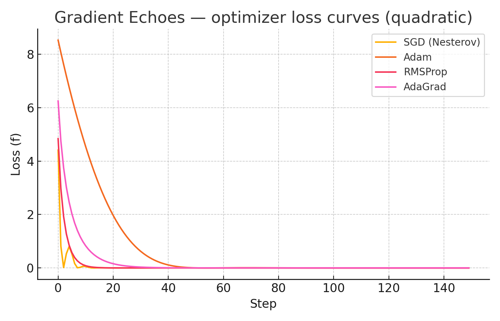

# 🌌 Gradient Echoes
> *Classical grit, quantum wit.*  
Optimization algorithms — both **classical** (SGD, Adam, L-BFGS, etc.) and **quantum-inspired** (QNG, SPSA, QAOA) — unified in one playground.



---

## ✨ Features
- 📦 Minimal, educational implementations of:
  - **Classical**: SGD (with momentum/Nesterov), Adam/AMSGrad, RMSProp, AdaGrad, L-BFGS, Nelder–Mead, SPSA
  - **Quantum**: Quantum Natural Gradient, QAOA loop, Parameter-Shift rule, Quantum SPSA
- 🧮 Clean abstractions: `Objective`, `Oracle`, `Constraint`, `Callback`, `Schedule`
- 📈 Visualizations: loss curves, 3D surfaces, optimizer trajectories
- 🧪 Fully tested with `pytest`, pre-commit linting, CI

---

## 🚀 Quickstart

Install locally:
```bash
git clone https://github.com/<you>/gradient-echoes.git
cd gradient-echoes
pip install -e ".[dev]"
